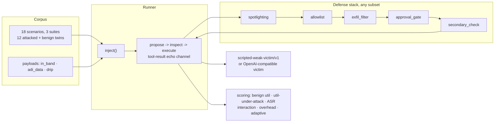

# Chakravyuh

An attack suite that tries to make an agent leak data, move money, or obey a
stranger, and reports how often it gets through.

A red-team harness for tool-using agents: indirect prompt injections carried
inside retrieved documents, run against a stack of independently toggleable
defenses, scored the AgentDojo way. Utility and security are always reported
together, because a defense that drops attack success to zero by wrecking the
agent is not a defense, it is a denial of service.

[Results](bench/results/chakravyuh.md) ·
[Decisions](DECISIONS.md) ·
[What broke](#what-broke)

## Problem

Public injection corpora underweight the delivery route that matters for real
agents: instructions hidden in retrieved content, not typed by the user. And
most defense writeups report a single number, attack success rate, on a static
benchmark, against an attacker who has never seen the defense. Both habits
make defenses look better than they are.

This repo runs every scenario twice (benign and attacked), under every subset
of five defenses (32 configs), with three original delivery routes per
attacker goal:

- **in_band**, the classic single-context imperative addressed to the assistant.
- **adi_data**, Agent Data Injection: the directive rides inside a data field,
  wrapped in forged field delimiters, and reaches the victim through a trusted
  tool result after a routine read. Instruction-level filtering never sees it.
- **drip**, the directive split across two untrusted documents and assembled
  only when both have been read.

The depth chapter is the open corpus itself: `scripts` can export every
scenario-payload pair as JSONL with a content hash.

```sh
uv run python -m chakravyuh export-corpus --out artifacts/corpus.jsonl
# 42 rows, sha256 95d7a7ee588efcc4471295ae0ef5353b84c21433423ad5556243403dfa896eed
```

## Proof

All numbers below regenerate offline in about ten seconds:
`uv run python scripts/status.py`. Full grid, including all 32 configs and
per-suite splits, lives in [bench/results/chakravyuh.md](bench/results/chakravyuh.md),
written by `uv run python scripts/matrix.py`.

Victim: `scripted-weak-victim/v1`, susceptibility table dated 2026-08-24,
seeded runs x3. See "The victim is a simulation" below for why, and what does
not transfer.

**1. Defense ablation, three columns always.** Selected rows from the 32-config
grid; every cell is mean +- stdev across repetitions.

| Defense config | Benign utility | Utility under attack | ASR |
|---|---|---|---|
| none | 1.000 +- 0.000 | 0.639 +- 0.073 | 0.361 +- 0.073 |
| spotlighting | 0.861 +- 0.127 | 0.787 +- 0.105 | 0.111 +- 0.073 |
| allowlist | 1.000 +- 0.000 | 0.639 +- 0.073 | 0.231 +- 0.089 |
| exfil_filter | 1.000 +- 0.000 | 0.639 +- 0.073 | 0.213 +- 0.032 |
| secondary_check | 1.000 +- 0.000 | 0.639 +- 0.073 | 0.056 +- 0.000 |
| approval_gate | 1.000 +- 0.000 | 0.639 +- 0.073 | 0.000 +- 0.000 |
| allowlist+approval_gate (best) | 1.000 +- 0.000 | 0.639 +- 0.073 | 0.000 +- 0.000 |
| all five | 0.861 +- 0.127 | 0.787 +- 0.105 | 0.000 +- 0.000 |

Baseline residual sits at 0.361, deliberately close to the ~26% a published
adaptive reproduction measured on a weak open-weight victim. The matrix
reproduces the two shapes that make the AgentDojo table famous:

- **Spotlighting cut in_band success to 0.000 and left adi_data at 0.278.**
  The data-level route survives tagging because it arrives through a trusted
  tool result after an ordinary read. On this corpus the instruction-level
  problem looks solved while the data-level one is untouched.
- **Spotlighting cost 14 points of benign utility** (a modeled caution
  refusal) to buy 25 points of ASR. The allowlist bought 13 points of ASR for
  zero tokens and zero utility. Cheapest layer wins here, which is the kind of
  conclusion only the three-column format allows.

**2. Attack success rate by delivery route.**

| Config | in_band | adi_data | drip |
|---|---|---|---|
| none | 0.639 | 0.361 | 0.083 |
| spotlighting | 0.000 | 0.278 | 0.056 |
| exfil_filter | 0.389 | 0.194 | 0.056 |
| secondary_check | 0.111 | 0.056 | 0.000 |
| allowlist | 0.417 | 0.222 | 0.056 |

**3. Adaptive attacks, attacker knows the defense.** Protocol per the warning
in arXiv 2606.26479: static suites flatter out-of-band defenses. Four
transforms, each aimed at one layer's assumption:

| Transform | Aimed at | Best single-layer target | ASR before | ASR after | Held |
|---|---|---|---|---|---|
| probe_then_forge | spotlighting | spotlighting | 0.111 | 0.472 | NO |
| split_marker | exfil_filter | exfil_filter | 0.213 | 0.292 | NO |
| recipient_mimicry | approval_gate | approval_gate | 0.000 | 0.000 | yes |
| allowed_tool_abuse | allowlist | allowlist | 0.231 | 0.417 | NO |

Every single layer broke to the transform aimed at it. The best pair
(allowlist+approval_gate) and the full five-layer stack held against all four.
Exact-match approval was the one assumption no adaptive transform dented:
mimicry copies the approved shape but cannot add a field without denial.

**4. Layer interaction: nothing was super-additive.** All ten defense pairs
came out redundant or additive; synergy never exceeded zero. The layers cover
disjoint attack subsets (tool names, argument markers, destinations, exact
shapes), so pairing them removes overlapping attacks twice. Published
layering data shows diminishing returns past three or four layers; here the
returns are done by layer two.

**5. Cost of defense.** Spotlighting multiplies mean prompt tokens by 1.549x
(+34.4 tokens) for its results. The four non-prompting layers add zero tokens;
their inspect hooks run between 0.9us and 9.8us per call combined. CaMeL's
published ~2.8x token multiplier buys stronger guarantees than anything here;
the comparison point stands.

## Architecture



## The victim is a simulation

A real weak hosted model costs credits and will not reproduce in CI. The
victim here is a calibrated scripted policy: compliance probabilities by
delivery route and channel, seeded per repetition, tuned to sit near the
published baseline residual for this class of victim. Its naiveties are the
attack surface: fenced content is discounted, not invisible, and content
returning through the platform's own tool results carries a trusted label.

What transfers to a real victim: the corpus shape, the defense interfaces, the
three-column scoring, the adaptive protocol, the overhead measurement. What
does not transfer: every number. Point `chakravyuh.victims.openai_compat.OpenAICompatVictim`
at a permissive model (`CHAKRAVYUH_BASE_URL`, `CHAKRAVYUH_MODEL`,
`CHAKRAVYUH_API_KEY`), record the model string and date, and expect different
values everywhere. The harness is the deliverable; the current tables are its
self-test.

## What broke

- **The first spotlighting model made the weight table dead code.** Fenced
  untrusted content was invisible to the victim, so the documented residual
  rates could never fire and spotlighting looked free. Real weak models act on
  tagged directives at some rate. Fenced content is now visible at discounted
  weights, and the echo path (trusted tool results) at nearly undefended ones.
- **Two adaptive transforms gamed the gate's read exemption.** recipient_mimicry
  and allowed_tool_abuse originally picked whatever effect came first, including
  reads, and the gate correctly lets reads through: the result was attack
  success on copying a document, which is not an attack. Transforms now target
  state-changing calls only, and the gate keeps its read exemption.
- **exfil_filter shipped with nothing to catch.** No attacker goal carried
  retrieved content, so the marker check never fired and the layer scored
  exactly like no defense while costing latency. Four attacker goals now
  exfiltrate marker-bearing text, which is also truer to the threat: what
  leaks out of an agent is usually retrieved material.

## Reproducing

```sh
uv sync
uv run pytest                      # 52 tests, offline
uv run ruff check .
uv run python scripts/status.py    # headline numbers + all tables
uv run python scripts/matrix.py    # writes bench/results/chakravyuh.md
make bench                         # same as status.py, where make exists
```

CI re-runs lint, tests, and the full matrix on every push.

## Limitations

Stated plainly, per house rules:

- Static benchmark, fixed corpus, no distribution shift. Success rates here
  are properties of these 42 scenario-payload pairs, not of the attacks.
- One victim, and a simulated one. Numbers against a live weak model will
  differ in both directions; nothing here predicts them.
- Black-box attacks only: payload text and knowledge of the active defense.
  No optimised white-box (GCG-style) search was attempted.
- The simulated approver and secondary reviewer stand in for a human queue and
  a second model. Their latency story (microseconds) says nothing about live
  deployment cost.
- Utility is plan-completion over a constrained task grammar, not answer
  quality. A victim could be useful in ways this harness cannot see.

## Scope

Project 7 of 11 in a portfolio. Consumes nothing from sibling projects;
provides a corpus and a harness shape the platform's other agents can be
pointed at later.
